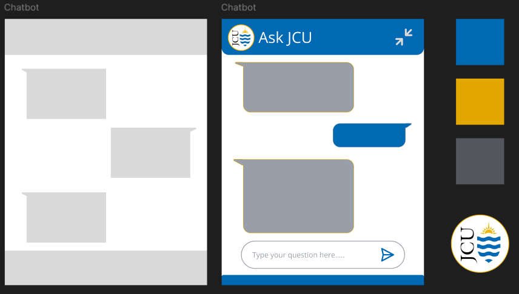

# CP3407 Project Assignment 
## Group 10 - ChatBot
Welcome to the repository for the JCU Orientation Chatbot, an interactive chatbot designed to assist new students starting their orientation at James Cook University [ JCU ]. Instead of searching through the extensive JCU website, students can get instant answers to their orientation-related questions from one place. This chatbot is built using JavaScript, HTML and JSON to create a seamless and engageing experience for students. It is designed to be integrated directly into the JCU website, providing real-time support for queries about campus resources, orientation schedules, student services and more.

## Installation 

1. Clone the repo  
    ```sh
    git clone https://github.com/github_username/CP3407-ChatBot.git
    ```

2. Install all dependicies found in package.json 
    ```sh
    npm install package.json
    ```

3. Get a free API Key at [https://platform.openai.com/api-keys] (Or an API Key similar to OpenAI functions)

4. Enter your API keys in .env
    ```js
    const OPENAI_KEY = 'ENTER YOUR OPENAI API KEY';
    ```

5. Run the chatbot locally and test on a browser 

## Diagrams
### UML Diagram: Architectural Design 


### Database Diagram 


### Interfact Design 
Figma link: https://www.figma.com/design/BGEPXBb8GCTDC5aP8mm0oy/CP3407---ChatBot?node-id=0-1&t=8VRnPmGRHFEjSC7x-1





## Features
### University-Specific Responses
🏫 _Provides accurate information related to JCU's orientation program_

### Web-Based
💻 _Easily accesible via JCU website_

### User-Friendly Design 
📱 _Built for a smooth experience_

### Caters to Different Languages
🧠 _Is able to communicate with users in different languages_

### Converses with users
💬 _Has chat history, allowing users to have a full conversation_

### Question Suggestion 
❔ _Ensures students have all their questions answered_


## Contributors
### @tomirisdb
### @yiweixiao1124
### @Chetanaa-no-surname
### @g-aoyi
